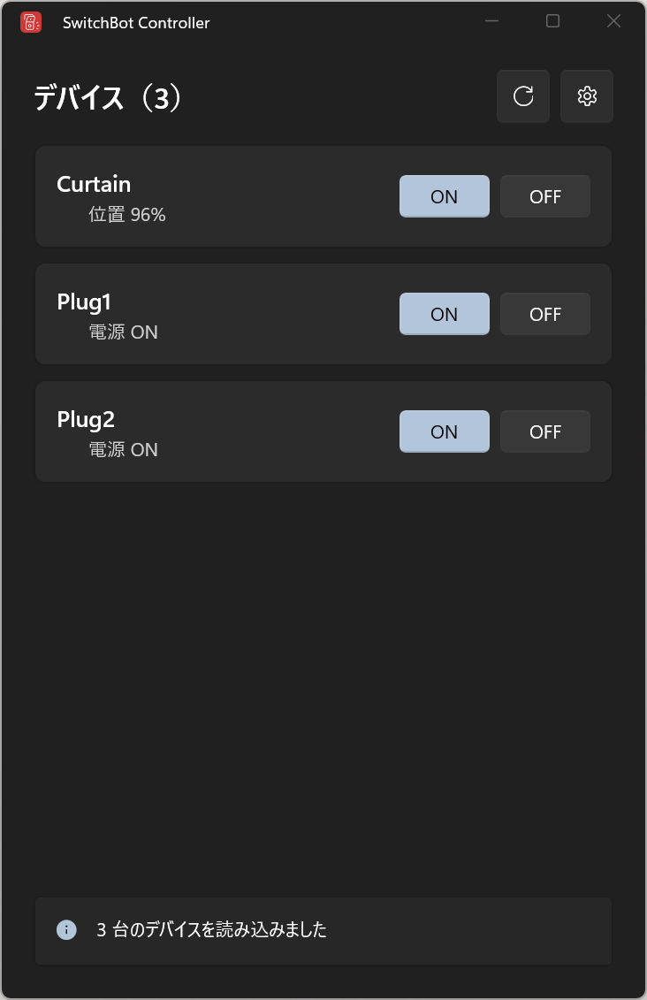

# SwitchBot Controller

SwitchBot Cloud APIを使い、`config.json`に登録したデバイスをWindowsから操作するWinUI 3アプリです。

- 登録した全デバイスの状態を起動時・再読み込み時に取得
- デバイスごとのON／OFF操作と操作結果の表示
- 一部デバイスでは電源状態、カーテン位置、動作状態など、APIが返した情報を表示
- 1台の状態取得に失敗しても、ほかのデバイスの表示と操作を継続
- 使用する`config.json`の選択と、既定のエディターでの直接編集
- インストール不要の自己完結型Windowsアプリ

SwitchBotデバイスを対象としており、Hub経由の赤外線リモコンには対応していません。



## 動作環境

- 64bit版のWindows 10 Version 1809以降、またはWindows 11
- インターネット接続
- SwitchBotアカウントとSwitchBot Cloud APIトークン

配布ZIPには.NETとWindows App SDKの実行環境が含まれるため、利用者側でSDKをインストールする必要はありません。

## インストールと起動

1. [GitHub Releases](https://github.com/tanagiew/SwitchBotController/releases)から最新の`SwitchBotController-vX.Y.Z-win-x64.zip`をダウンロードします。
2. ZIPを任意のフォルダーへ展開します。
3. `config.json.example`を`config.json`という名前でコピーし、後述の内容を設定します。
4. `SwitchBotController.exe`を実行します。

現在の配布物にはコード署名がないため、初回起動時にWindowsの警告が表示される場合があります。信頼できるGitHub Releasesから取得したファイルであることを確認してから実行してください。

## `config.json`の準備

### APIトークン

1. SwitchBotスマートフォンアプリへログインします。
2. 「プロフィール」→「設定」→「基本データ」を開き、アプリバージョンを10回タップします。
3. 表示された「開発者向けオプション」を開き、トークンを確認します。


### デバイスのBLE MAC

各SwitchBotデバイスの「設定」→「デバイス情報」を開き、BLE MACを確認します。


### 設定例

`config.json.example`を参考に、次の形式で記述します。`ble_mac`からコロン（`:`）を除いてください。

```json
{
  "api_token": "SwitchBotアプリで確認したトークン",
  "devices": [
    { "name": "Curtain", "ble_mac": "AABBCCDDEEFF" },
    { "name": "LED", "ble_mac": "112233445566" }
  ]
}
```

- `api_token`: SwitchBot Cloud APIトークン
- `name`: アプリに表示する任意のデバイス名
- `ble_mac`: デバイスのBLE MAC（コロンなし）

従来の`api_key`／`device_id`形式も互換性のため読み込めますが、新しい設定には上記形式を推奨します。

> [!CAUTION]
> `config.json`にはAPIトークンが含まれます。公開リポジトリへの追加、他人への送付、スクリーンショットへの写り込みを避けてください。

## 設定ファイルの切り替え

画面右上の設定ボタンから、使用するJSONファイルを選択できます。選択したファイルを読み込めない場合、現在使用中の設定は維持されます。

アプリが保存するのは選択したファイルの絶対パスだけです。APIトークンとデバイス情報は元の`config.json`にのみ保持されます。保存先は非MSIX版では`%LOCALAPPDATA%\SwitchBotController\settings.json`です。

「現在の設定ファイルを開く」で`config.json`を既定のエディターから編集できます。編集後は画面右上の再読み込みボタンで反映してください。

## 開発

### 必要な環境

- .NET 10 SDK
- Visual Studio 2026のWinUIアプリ開発環境
- Windows App SDK

### ビルドとテスト

```powershell
dotnet restore .\SwitchBotController.sln
dotnet test .\tests\SwitchBotController.Core.Tests\SwitchBotController.Core.Tests.csproj
dotnet test .\tests\SwitchBotController.App.Tests\SwitchBotController.App.Tests.csproj
dotnet build .\SwitchBotController.sln --configuration Debug --property:Platform=x64
dotnet run --project .\src\SwitchBotController.App\SwitchBotController.App.csproj --property:Platform=x64
```

### 配布ZIPの作成

```powershell
.\scripts\publish-release.ps1 -Version 1.0.0
```

自己完結型・単一EXEのunpackaged x64アプリを公開し、`artifacts\SwitchBotController-v1.0.0-win-x64.zip`を作成します。ZIPには`SwitchBotController.exe`と`config.json.example`だけが含まれ、`config.json`は含まれません。単一EXEは初回起動時に必要な実行環境をWindowsの一時領域へ展開します。

## ライセンス

[MIT License](./LICENSE.md)
