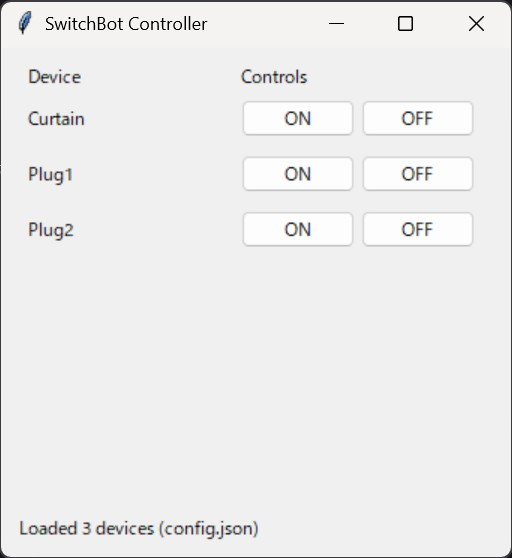
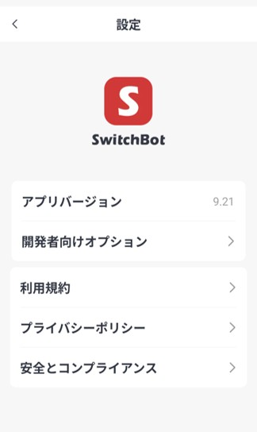
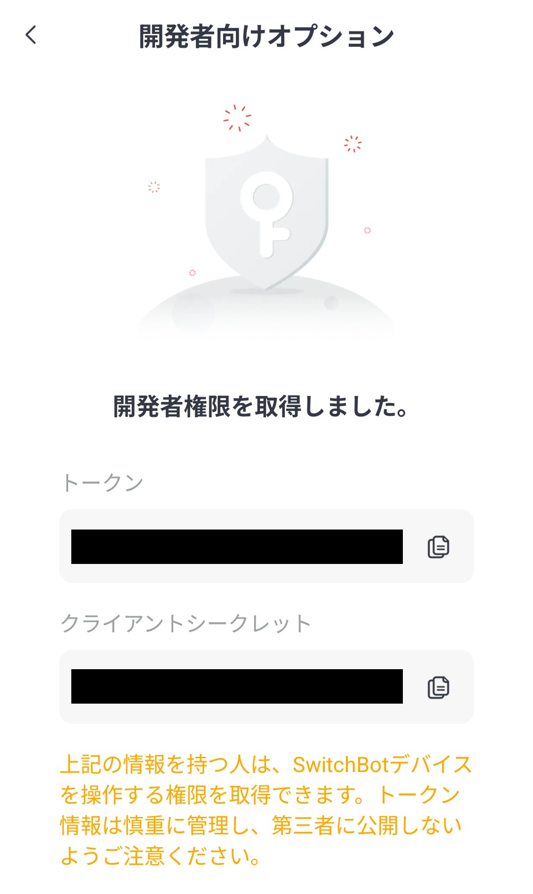
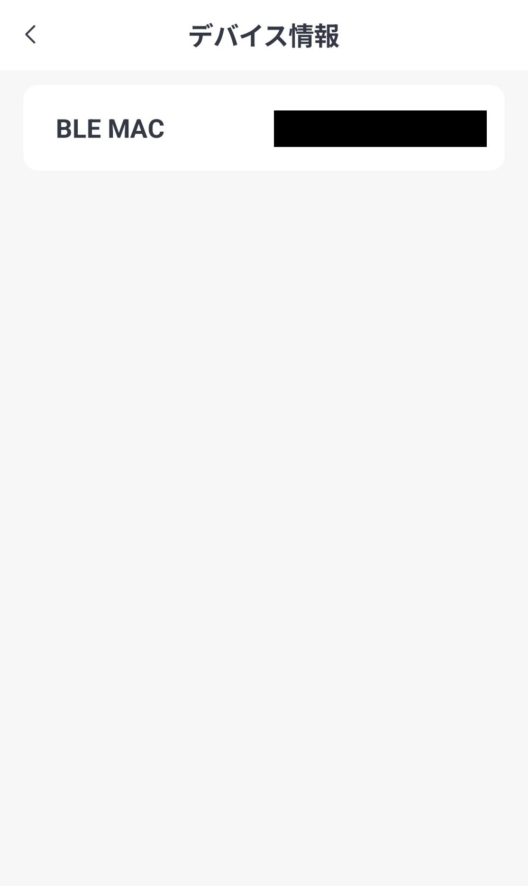

# SwitchBot Controller

- SwitchBot Cloud API を使って、登録したデバイスを ON / OFF できる最小構成のWindows向けGUIアプリです。  
- SwitchBotデバイスにのみ対応し、Hub経由の赤外線リモコンには対応していません。
- デバイスの追加・編集は **`config.json` を直接編集**して行います（アプリ上に設定用UIはありません）。



## 使用方法

- Releaseから最新の実行ファイルのzip (SwitchBotController_XX.zip)をダウンロードしてください。
- zipを解凍後、ご自身の環境に合わせたconfig.jsonを作成し、SwitchBotController_XX.exeと同じ階層に配置してください。
- SwitchBotController_XX.exeを実行してください。

### config.json

1. SwitchBotのスマホアプリを開き、ログインします。
2. プロフィール > 設定 > 基本データ の **アプリバージョン** を10回タップします。
3. 開発者向けオプションをタップすると表示される **トークン** をメモしておいてください。





4. SwitchBotデバイスの 設定 > デバイス情報 を開き **BLE MAC** をメモしておいてください。




5. config.json.exampleに倣ってconfig.jsonを新規作成してください。
  - api_token : メモした **トークン**
  - name : アプリ上で表示するデバイス名
  - ble_mac : デバイスごとの **BLE MAC** （コロンを除く）

---

## ビルド方法
ご自身でビルドする場合は下記情報を参考にしてください。

### Requirements
- Windows
- Python 3.10+（推奨: 3.12）

### Repository Layout (recommended)

```
SwitchBotController/
  src/
    switchbot_controller.py
  scripts/
    build.ps1
  assets/
    icon.ico
  requirements.txt
  config.json            # local only (DO NOT COMMIT)
```

### Setup
```bat
cd /d C:\workspace\SwitchBotController
py -3.12 -m venv .venv
.venv\Scripts\activate
python -m pip install --upgrade pip
pip install -r requirements.txt
python src\switchbot_controller.py
```

### One-command build
```powershell
powershell -ExecutionPolicy Bypass -File .\scripts\build.ps1
```

Output:
- `dist\SwitchBotController.exe`